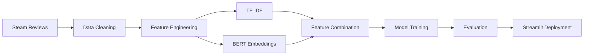

# 🎮 SteamNLP

### Steam Reviews Sentiment Analysis & Recommendation Prediction

<p align="center">
  
  
  
  
  
</p>

<p align="center">
  Steam kullanıcı incelemelerini analiz ederek <b>önerilir / önerilmez</b> tahmini yapan,
  NLP ve Makine Öğrenmesi teknikleri kullanan bir proje.
</p>

---

## 📌 Proje Hakkında

SteamNLP, Steam platformundan elde edilen kullanıcı incelemelerini analiz ederek oyuncuların bir oyunu tavsiye edip etmeyeceğini tahmin etmeyi amaçlayan bir Doğal Dil İşleme (NLP) projesidir.

Proje kapsamında:

* 🧹 Veri temizleme ve ön işleme
* 📊 Keşifsel Veri Analizi (EDA)
* 🔤 TF-IDF özellik çıkarımı
* 🤖 Makine Öğrenmesi modelleri
* 🧠 BERT tabanlı embeddingler
* 🌐 Streamlit arayüzü

geliştirilmiştir.

---

## 🚀 Kullanılan Teknolojiler

| Teknoloji             | Amaç                  |
| --------------------- | --------------------- |
| Python                | Temel geliştirme dili |
| Pandas                | Veri işleme           |
| NumPy                 | Sayısal işlemler      |
| Matplotlib & Seaborn  | Veri görselleştirme   |
| Scikit-Learn          | Makine öğrenmesi      |
| Sentence Transformers | BERT embeddingleri    |
| Streamlit             | Web uygulaması        |
| Joblib                | Model kayıt işlemleri |

---

## 🏗️ Proje Mimarisi

```text
SteamNLP/
│
├── data/
│   ├── raw/
│   └── processed/
│
├── models/
│   ├── champion_model.joblib
│   └── features_champion.joblib
│
├── pages/
│
├── utils/
│   ├── feature_engineering.py
│   └── loader.py
│
├── SteamNLP.ipynb
├── app.py
└── README.md
```

---

## 🔄 Proje Akışı



---

## ⚙️ Özellik Mühendisliği

### TF-IDF

İnceleme metinleri TF-IDF yöntemi ile vektörleştirilmiştir.

```python
tfidf_vectorizer.joblib
```

oluşturularak tekrar kullanılabilir hale getirilmiştir.

### BERT Embeddings

Sentence Transformer modeli kullanılarak:

* Metin embeddingleri çıkarılmıştır
* Boyut indirgeme (SVD) uygulanmıştır
* Ölçeklendirme gerçekleştirilmiştir
* Nihai özellik setine eklenmiştir

---

## 📈 Modelleme

Projede farklı sınıflandırma algoritmaları denenmiş ve performansı en yüksek model:

```bash
models/champion_model.joblib
```

olarak kaydedilmiştir.

Değerlendirmede kullanılan metrikler:

* Accuracy
* Precision
* Recall
* F1 Score
* ROC-AUC

---

## 🌐 Streamlit Uygulaması

Uygulamayı çalıştırmak için:

```bash
python -m streamlit run app.py
```

veya

```bash
streamlit run app.py
```

---

## 💻 Kurulum

### Repository'i Klonlayın

```bash
git clone https://github.com/Asyleon/SteamNLP.git
```

### Sanal Ortam Oluşturun

```bash
python -m venv venv
```

### Aktifleştirin

```bash
venv\Scripts\activate
```

### Gereksinimleri Kurun

```bash
pip install -r requirements.txt
```

---

## 📊 Gelecek Çalışmalar

* [ ] Hyperparameter Optimization (Optuna)
* [ ] SHAP Açıklanabilirlik Analizi
* [ ] Docker Desteği
* [ ] Cloud Deployment
* [ ] Model Monitoring
* [ ] CI/CD Pipeline

---

## 📁 Önemli Dosyalar

| Dosya                  | Açıklama                  |
| ---------------------- | ------------------------- |
| SteamNLP.ipynb         | Veri analizi ve modelleme |
| app.py                 | Streamlit uygulaması      |
| champion_model.joblib  | Nihai model               |
| feature_engineering.py | Özellik mühendisliği      |
| loader.py              | Veri yükleme araçları     |

---

## 📜 Proje Durumu

🟢 Aktif Geliştirme

Bu proje eğitim ve araştırma amaçlı geliştirilmiştir.

---

<p align="center">
  <b>SteamNLP</b><br>
  Natural Language Processing for Steam Reviews 🎮
</p>
